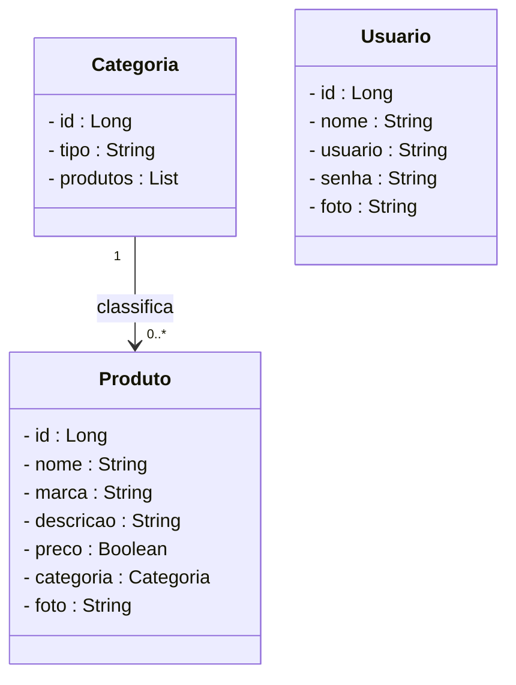
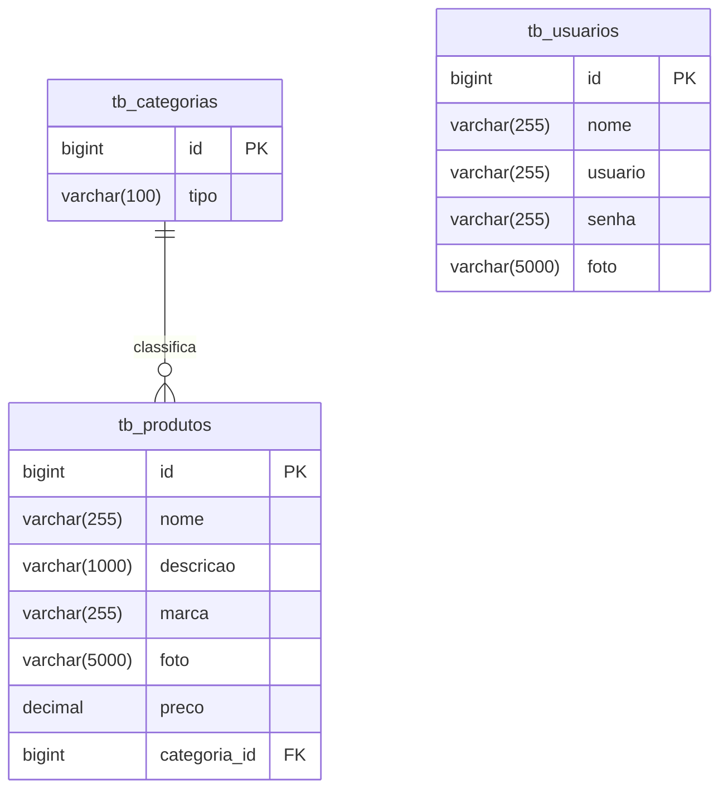

# Projeto Farmácia - Backend com Spring Boot

<br />

<div align="center">
     
</div>


<br />

<div align="center">
  
  
  
  
  
  
  


</div>

<br />

## 1. Descrição

<br />

A Farmácia é uma aplicação que permite que criem, editem e visualizem produtos relacionadas a categorias variadas, de forma organizada e segura. Este projeto foi desenvolvido com fins educacionais, simulando uma aplicação real de um e-commerce farmacêutico para praticar conceitos de API REST com Java e Spring Boot.

Entre os principais recursos que um blog pessoal oferece, destacam-se:

1. Criação, edição e exclusão de produtos
2. Associação de produtos a categorias específicas
3. Cadastro e autenticação de usuários
4. Visualização de produtos por nome ou preço
5. Controle de acesso a operações sensíveis

<br />

## 2. Sobre esta API

<br />

A API da farmácia foi desenvolvida utilizando **Java** e o **framework Spring**, seguindo os princípios da Arquitetura MVC e REST. Ela oferece endpoints para o gerenciamento dos recursos **Usuário**, **Produto** e **Categoria**, permitindo a visualização de produtos cadastrados.

<br />

### 2.1. Principais funcionalidades da API:

<br />

1. Consulta, cadastro, login e atualização dos dados de usuários
2. Consulta, criação e gerenciamento de categorias para classificar produtos
3. Criação, edição, listagem e remoção de produtos
4. Associação de produtos a categorias
5. Autenticação via token JWT para segurança nas requisições

<br />

## 3. Diagrama de Classes

<br />

O **Diagrama de Classes** é um modelo visual usado na programação orientada a objetos para representar a estrutura de um sistema. Ele exibe classes, atributos, métodos e os relacionamentos entre elas, como associações, heranças e dependências.

Esse diagrama ajuda a planejar e entender a arquitetura do sistema, mostrando como as entidades interagem e se conectam. É amplamente utilizado nas fases de design e documentação de projetos.

<br />



<br />

## 4. Diagrama Entidade-Relacionamento (DER)

<br />

O **DER (Diagrama Entidade-Relacionamento)** do projeto **Blog Pessoal** representa de forma visual como os dados estão organizados no banco de dados relacional e como as entidades se relacionam entre si.

<br />



<br />

## 5. Tecnologias utilizadas

<br />

| Item                          | Descrição       |
| ----------------------------- | --------------- |
| **Servidor**                  | Tomcat          |
| **Linguagem de programação**  | Java            |
| **Framework**                 | Spring Boot     |
| **ORM**                       | JPA + Hibernate |
| **Banco de dados Relacional** | MySQL           |
| **Segurança**                 | Spring Security |
| **Autenticação**              | JWT             |
| **Testes automatizados**      | JUnit           |
| **Documentação**              | SpringDoc       |

<br />

## 6. Requisitos

<br />

Para executar os códigos localmente, você precisará:

- [Java JDK 17+](https://www.oracle.com/java/technologies/javase/jdk17-archive-downloads.html)
- Banco de dados [MySQL](https://dev.mysql.com/downloads/)
- [STS](https://spring.io/tools)
- [Insomnia](https://insomnia.rest/download) ou [Postman](https://www.postman.com/)

<br />

## 7. Como Executar o projeto no STS

<br />

### 7.1. Importando o Projeto

1. Clone o repositório do Projeto [Farmácia](https://github.com/sofia-araujo/projeto_final_bloco_02) dentro da pasta do *Workspace* do STS

```bash
git clone https://github.com/sofia-araujo/projeto_final_bloco_02.git
```

2. **Abra o STS** e selecione a pasta do *Workspace* onde você clonou o repositório do projeto
3. No menu superior do STS, clique na opção: **File 🡲 Import...**
4. Na janela **Import**, selecione a opção: **General 🡲 Existing Projects into Workspace** e clique no botão **Next**
5. Na janela **Import Projects**, no item **Select root directory**, clique no botão **Browse...** e selecione a pasta do Workspace onde você clonou o repositório do projeto
6. O STS reconhecerá o projeto automaticamente
7. Marque o Projeto Blog Pessoal no item **Projects** e clique no botão **Finish** para concluir a importação

<br />

### 7.2. Executando o projeto

1. Na Guia **Boot Dashboard**, localize o  **Projeto Farmácia**
2. Selecione o **Projeto Farmácia**
3. Clique no botão **Start or Restart**  para iniciar a aplicação
4. Caso seja perguntado se você deseja autorizar o acesso ao projeto via rede, clique no botão **Permitir Acesso**
5. Acompanhe a inicialização do projeto no console do STS
6. Verifique se o banco de dados `db_blogpessoal` foi criado corretamente e se as tabelas foram geradas automaticamente.
7. Utilize o [Insomnia](https://insomnia.rest/) ou o [Postman](https://www.postman.com/) para testar os endpoints.

<br />

> [!TIP]
>
> Ao acessar a URL `http://localhost:8080` em seu navegador, a interface do Swagger será carregada automaticamente, permitindo a visualização e a interação com os endpoints da API, bem como a consulta dos modelos de dados utilizados.

<br />

## 8. Como Executar os Testes no STS

### 8.1. **Localizando as Classes de Teste**

- Na **Package Explorer**, navegue até a Source Folder `src/test/java`
- Localize as classes que contém os testes (classes cujo nome terminam com a palavra **Test**)

<br />

### 8.2. **Executando os Testes**

Você pode executar os testes de duas formas:

#### 👉 Opção 1: Executar uma classe de teste específica

- Clique com o botão direito sobre a classe de teste
- Selecione a opção `Run As > JUnit Test`

#### 👉 Opção 2: Executar todos os testes do projeto

- Clique com o botão direito sobre a pasta do projeto
- Selecione: `Run As > JUnit test` 

<br />

### 8.3. **Verificando os Resultados**

- Ao executar os testes, na **Package Explorer**, será exibida a guia **JUnit**  mostrando os resultados dos testes
- Os testes que falharem serão destacados em vermelho, e os bem-sucedidos em verde
- Clique nos testes para visualizar os detalhes ou mensagens de erro no item **Failure Trace**

<br />

## 9. Contribuição

<br />

Este repositório é parte de um projeto educacional, mas contribuições são sempre bem-vindas! Caso tenha sugestões, correções ou melhorias, fique à vontade para:

- Criar uma **issue**
- Enviar um **pull request**
- Compartilhar com colegas que estejam aprendendo Java!

<br />

##  10. Contato

<br />

Desenvolvido por [**Sofia**](https://github.com/sofia-araujo)
Para dúvidas, sugestões ou colaborações, entre em contato via GitHub ou abra uma issue!